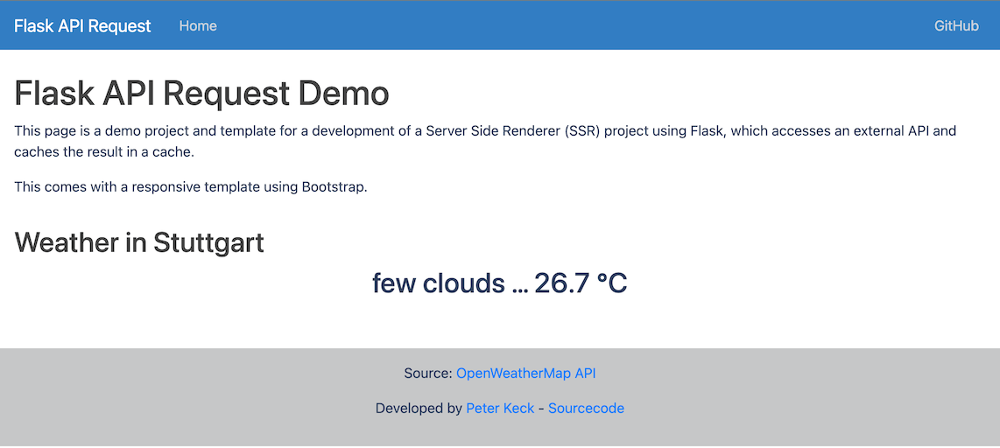

<h1 align="center">Welcome to flask-api-request 👋</h1>
<p>
  
  <a href="https://github.com/pyrrolizin/flask-api-request/blob/master/LICENSE" target="_blank">
    
  </a>
  <a href="https://twitter.com/kekz" target="_blank">
    <!--img alt="Twitter: kekz" src="https://img.shields.io/twitter/follow/kekz.svg?style=social" / -->
  </a>
</p>


>This project is a starting platform for a SSR (Server Side Rendered) Flask project that pulls data from an external API and caches the result. 
>The project includes a responsive Jinia2 template with Bootstrap.

### 🏠 [Homepage](https://github.com/pyrrolizin/flask-api-request)

### ✨ Demo (OpenWeatherMap-Api - Current weather in Stuttgart, Germany)

tbd



## Install

**Installation script**

```sh
make setup
```

This demo requires **Python 3.5 and later**. The setup command creates a virtual environment (venv) and installs all packages from the requirements.txt file.
*or* 

**Manual installation**

```sh
virtualenv venv
source ./venv/bin/activate
pip install -r requirements.txt 
```


### Environment varaibles

You can set the following environment variables:

| NAME        |  *required*  |  Comment  |
| ----------- | ------------ | --------- |
| `SECRET_KEY`  |  *no*        |  A secret key used to securely sign the session cookie (Flask). It is not needed for this demo, but every Flask application should have one. You can create your own `SECRET_KEY` with `python -c 'import secrets; print(secrets.token_hex())'`. If it is empty, a random string will be generated each time you start it.[More information and source](https://flask.palletsprojects.com/en/2.0.x/config/#SECRET_KEY) |
| `API_KEY`     | **yes**      |  You can get your own free OpenWeatherApi key on this website: https://home.openweathermap.org/users/sign_up  |

You can either set the environment variables or use the `.env` file:
Make your own copy of the `.env` file and specify the `.env` and add the keys. 

```sh
cp ./src/.env_default ./src/.env
```

Learn more about the OpenWeatherMap API: https://openweathermap.org/api

## Run tests

```sh
make test
```

## Usage (Debug only)

```sh
make run
```

The run command automatically activates the virtual environment (venv) and starts the application in debug mode.

## Create Documentation

```sh
make doc
```

## Deployment on Heroku

*tbd*

## Author

👤 **Peter Keck**

* Github: [@pyrrolizin](https://github.com/pyrrolizin)

## 🤝 Contributing

Contributions, issues and feature requests are welcome!<br />Feel free to check [issues page](https://github.com/pyrrolizin/flask-api-request/issues). 
Please use [Black](https://black.readthedocs.io/) as code formatter.

## Show your support

Give a ⭐️ if this project helped you!

## 📝 License

Copyright © 2022 [Peter Keck](https://github.com/pyrrolizin).<br />
This project is [MIT](https://github.com/pyrrolizin/flask-api-request/blob/master/LICENSE) licensed.
